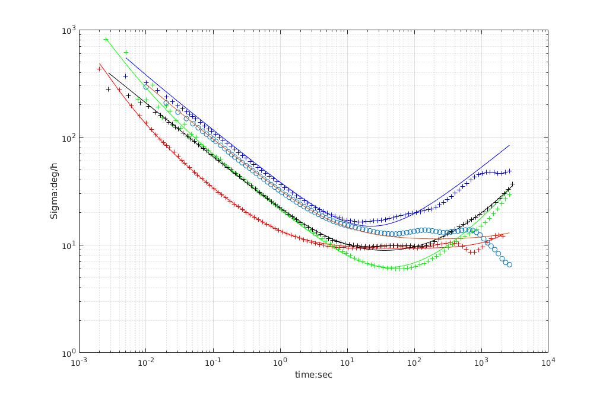
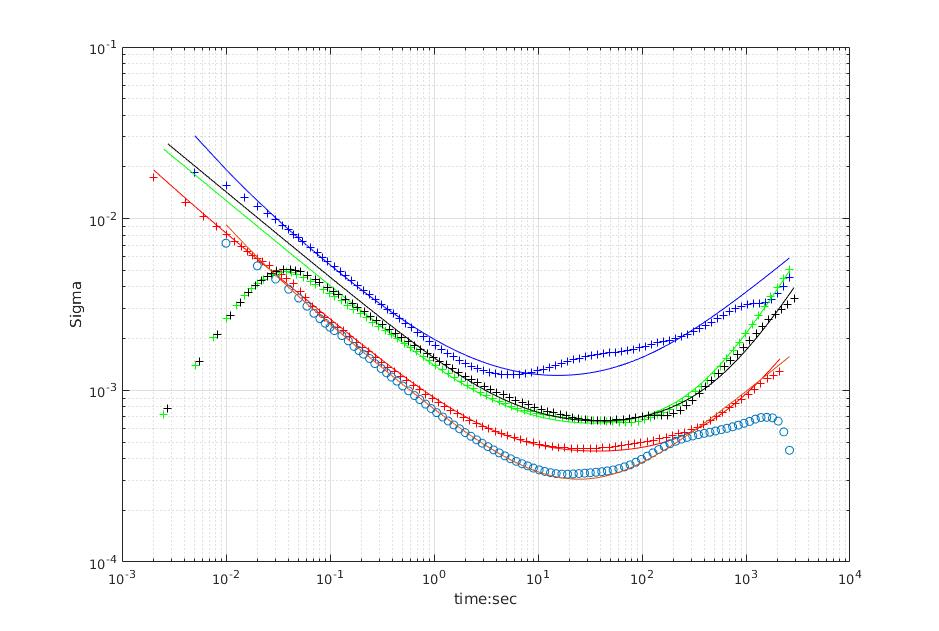

# imu_utils

一个用于分析 IMU 性能的 ROS 工具包，是 Allan 方差工具的 C++ 版本。
图表由 Matlab 绘制，相关脚本在 scripts 目录中。

本工具主要用于对 IMU 数据进行 Allan 方差分析。
采集数据时请保持 IMU 静止，建议时长约 2 小时。

## 参考资料

参考技术报告：[Allan Variance: Noise Analysis for Gyroscopes](http://cache.freescale.com/files/sensors/doc/app_note/AN5087.pdf)、[vectornav gyroscope](https://www.vectornav.com/support/library/gyroscope) 和
[An introduction to inertial navigation](http://www.cl.cam.ac.uk/techreports/UCAM-CL-TR-696.html)。

```
Woodman, O.J., 2007. An introduction to inertial navigation (No. UCAM-CL-TR-696). University of Cambridge, Computer Laboratory.
```

参考 Matlab 代码：[GyroAllan](https://github.com/XinLiGitHub/GyroAllan)

## IMU 噪声参数

参数 | YAML 字段 | 符号 | 单位
--- | --- | --- | ---
陀螺仪白噪声 | gyr_n |  | 
加速度计白噪声 | acc_n |  | 
陀螺仪偏置不稳定性 | gyr_w |  | 
加速度计偏置不稳定性 | acc_w |  | 

- 白噪声取在 tau=1 处。
- 偏置不稳定性取在曲线最小值附近。

依据技术报告：[Allan Variance: Noise Analysis for Gyroscopes](http://cache.freescale.com/files/sensors/doc/app_note/AN5087.pdf)

## 示例结果




- 蓝色：Vi-Sensor，ADIS16448，200Hz
- 红色：3dm-Gx4，500Hz
- 绿色：DJI-A3，400Hz
- 黑色：DJI-N3，400Hz
- 圆圈：xsens-MTI-100，100Hz

## 如何编译与运行

### 编译

```bash
sudo apt-get install libdw-dev
```

- 将 ROS 包 imu_utils 放入工作空间 src 目录（通常工作空间名为 catkin_ws）。
- 进入工作空间后，使用 catkin_make 编译。

### 运行

- 采集数据时保持 IMU 静止，建议采集约 2 小时。
- 或者播放 rosbag 数据集。

```bash
rosbag play -r 200 imu_A3.bag
```

- 使用 roslaunch 启动节点。

```bash
roslaunch imu_utils A3.launch
```

请注意 roslaunch 配置文件：

```xml
<launch>
    <node pkg="imu_utils" type="imu_an" name="imu_an" output="screen">
        <param name="imu_topic" type="string" value="/djiros/imu"/>
        <param name="imu_name" type="string" value="A3"/>
        <param name="data_save_path" type="string" value="$(find imu_utils)/data/"/>
        <param name="max_time_min" type="int" value="120"/>
        <param name="max_cluster" type="int" value="100"/>
    </node>
</launch>
```

### 示例输出

```text
type: IMU
name: A3
Gyr:
   unit: " rad/s"
   avg-axis:
      gyr_n: 1.0351286977809465e-04
      gyr_w: 2.9438676109223402e-05
   x-axis:
      gyr_n: 1.0312669892959053e-04
      gyr_w: 3.3765827874234673e-05
   y-axis:
      gyr_n: 1.0787155789128671e-04
      gyr_w: 3.1970693666470835e-05
   z-axis:
      gyr_n: 9.9540352513406743e-05
      gyr_w: 2.2579506786964707e-05
Acc:
   unit: " m/s^2"
   avg-axis:
      acc_n: 1.3985049290745563e-03
      acc_w: 6.3249251509920116e-04
   x-axis:
      acc_n: 1.1687799474421937e-03
      acc_w: 5.3044554054317266e-04
   y-axis:
      acc_n: 1.2050535351630543e-03
      acc_w: 6.0281218607825414e-04
   z-axis:
      acc_n: 1.8216813046184213e-03
      acc_w: 7.6421981867617645e-04
```

## 数据集

DJI A3: 400Hz  
下载链接：[百度网盘](https://pan.baidu.com/s/1jJYg8R0)

DJI N3: 400Hz  
下载链接：[百度网盘](https://pan.baidu.com/s/1pLXGqx1)

ADIS16448: 200Hz  
下载链接：[百度网盘](https://pan.baidu.com/s/1dGd0mn3)

3dM-GX4: 500Hz  
下载链接：[百度网盘](https://pan.baidu.com/s/1ggcan9D)

xsens-MTI-100: 100Hz  
下载链接：[百度网盘](https://pan.baidu.com/s/1i64xkgP)

